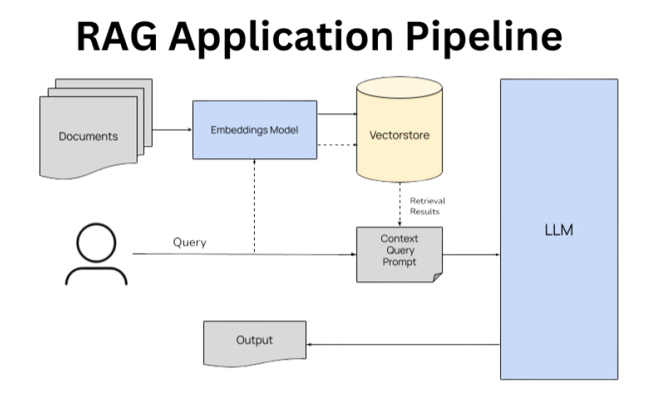

# Career Advice System
## Implementing a Retrieval Augmented Generation (RAG) System



This repository contains a system for providing personalized career advice using embeddings and generative models. The system processes job data, creates embeddings, and generates career advice based on user queries.

## Project Structure

- `Data/`
  - `jobs_data.csv`: Contains job data with columns such as job_title, description, requirements, and career_level.
- `src/`
  - `data_prep.py`: Performs data preparation and cleansing.
  - `embedder_model.py`: Embeds the cleaned data using Sentence Transformers and creates a vector database using FAISS.
  - `context_query.py`: Takes a user query and returns the top-ranked similar documents from the vector database.
  - `generative_LLM.py`: Uses a generative model to provide user-friendly advice based on the returned documents.
- `app.py`: Flask API to provide career advice via an endpoint.
- `main.py`: Script to run the process end-to-end.
- `requirements.txt`: Lists the dependencies required to run the project.
- `.gitignore`: Specifies files and directories to be ignored by git.

## Installation

1. Clone the repository:
    ```sh
    git clone https://github.com/ShehaTaa/career-advice.git
    cd career-advice
    ```

2. Install the required packages:
    ```sh
    pip install -r requirements.txt
    ```

## Usage

### Running the Flask API

1. Start the Flask API server:
    ```sh
    python app.py
    ```

2. Send a POST request to `http://localhost:5000/get_career_advice` with a JSON body containing the user query:
    ```json
    {
        "query": "Machine Learning Engineer"
    }
    ```

### Running the Main Script

1. Run the main script to get career advice:
    ```sh
    python main.py
    ```

## Docker

You can also run the project using Docker.

### Building the Docker Image

1. Build the Docker image:
    ```sh
    docker build -t career-advice .
    ```

### Running the Docker Container

1. Run the Docker container:
    ```sh
    docker run -p 5000:5000 career-advice
    ```

2. The Flask API will be available at `http://localhost:5000`.

## Contributing

Contributions are welcome! Please open an issue or submit a pull request for any improvements or bug fixes.

## License

This project is licensed under the MIT License.

